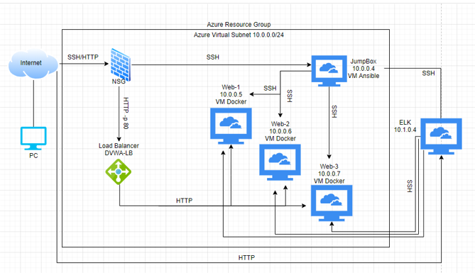
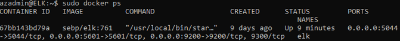

# ELK-Monitoring-Solution
This is documentation on a project I completed where I built a cloud-based solution that uses ELK stack monitoring for vulnerable web applications.
The files in this repository were used to configure the network depicted below.

These files have been tested and used to generate a live ELK deployment on Azure. They can be used to either recreate the entire deployment pictured above. Alternatively, select portions of the playbook file may be used to install only certain pieces of it, such as Filebeat.

Playbook files:
- [Web Playbook](./Ansible/ansible-playbook.yml)
- [ELK Playbook](./Ansible/install-elk.yml)
- [Filebeat Playbook](./Ansible/filebeat-playbook.yml)
- [Metricbeat Playbook](./Ansible/metricbeat-playbook.yml)

This document contains the following details:
- Description of the Topology
- Access Policies
- ELK Configuration
  - Beats in Use
  - Machines Being Monitored
- How to Use the Ansible Build

---  

## Description of the Topology

The main purpose of this network is to expose a load-balanced and monitored instance of DVWA, the D*mn Vulnerable Web Application.

Load balancing ensures that the application will be highly stable, in addition to restricting access to the network.
Load balancers are important on any cloud server due to adding redundancy and protection from DDoS attacks by adjusting traffic. Having a jump box allows administrators to first connect to a jump box before completing administrative tasks which provides additional security.

Integrating an ELK server allows users to easily monitor the vulnerable VMs for changes to the jumpbox and system network.

Filebeat allows you to specify logs or entries that can be forwarded and centralized from another database. This allows for easy monitoring on your deployed web servers.

Metricbeat periodically collects metrics from the operating system from all services running on the server, after data collection, it is output into a format you specify such as Elasticsearch.

|   Name   	| Function   	| IP Address 	| Operating System 	|
|:--------:	|------------	|:----------:	|------------------	|
| Jump Box 	| Gateway    	| 10.0.0.4   	| Linux            	|
| Web-1    	| Server     	| 10.0.0.5   	| Linux            	|
| Web-2    	| Server     	| 10.0.0.6   	| Linux            	|
| Web-3    	| Server     	| 10.0.0.7   	| Linux            	|
| ELK      	| Monitoring 	| 10.1.0.4   	| Linux            	|

---  

### Access Policies

The machines on the internal network are not exposed to the public Internet.

Only the Jump Box machine can accept connections from the Internet. Access to this machine is only allowed from my IP address.

Machines within the network can only be accessed by the Ansible container (Jump Box) with the IP: 40.121.158.1 (dynamic & changes). This machine can access the ELK VM.

Please see below a summary of the access policies in place.

|   Name   	| Publicly Accessible 	| Allowed IP Address 	|
|:--------:	|---------------------	|:------------------:	|
| Jump Box 	| Yes                 	| My IP              	|
| Web-1    	| No                  	| 10.0.0.4           	|
| Web-2    	| No                  	| 10.0.0.4           	|
| Web-3    	| No                  	| 10.0.0.4           	|
| ELK      	| No                  	| 40.121.158.1       	|

---  

### Elk Configuration

Ansbile was used to automate the configuration of the ELK machine. Ansible is extremely important in freeing up time, by simplyifing and automating repetitive tasks and operations.

The ELK playbook implements the following tasks:
- Configuration of Admin account with Docker: This creates the administrator account for the new Web VM.
- Install docker.io: This installs the docker container needed for other software.
- Install python3: This install python on the VM.
- Increase virtual memory: This increases the virtual memory that ELK can use, this is important because ELK uses a lot of ram and will not function properly without additional memory.
- Download and install docker elk container with published ports '5601,9200,5044': This allocates the ports that the docker elk container will use.
- Enable service docker on boot: This will allow Elk to boot up on startup.

This screenshot displays the result of running `docker ps` after successfully configuring the ELK instance.

---  

### Target Machine & Beats

This Elk server is configured to monitor the following machines:

- Web-1:	 10.0.0.5
- Web-2:	 10.0.0.6
- Web-3:	 10.0.0.7

We have installed the following Beats on these machines:

- Filebeat
- Metricbeat

These beats allow us to collect information from each machine, for example:

Filebeat allows for the forwarding and centralizing of log data. Filebeat monitors log files or locations you configure, collects log events and sends them to Elasticsearch or Logstash for indexing.
The log events can be viewed to see things such as syslog files, config files, data or bin files. These files can show important information such as log in/authorisation time, system config changes that were made etc.

Metricbeat collects metrics from the OS and running services on the server. The statistics are sent and output to where you specify, such as Elasticsearch or Logstash.
The type of data collected by metricbeat can display important information such as CPU usage which can indicate a DoS attack, Mem usage, inbound/outbound traffic.

---  

### Using the Playbook

In order to use the playbook, you will need to have an Ansible control node already configured. Assuming you have such a control node provisioned: 

SSH into the control node and follow the steps below:

- Copy the playbook file to ansible container.
- Update the config file to include the servers.
- Run the playbook, and navigate to the ELK server to check installation worked correctly. You can also check Kibana to see that it's working correctly.

- The playbook is the file that is copied to the ansible container (jump box), where the play is run and installed across the machines.
- The playbook config file is updated to ensure that the playbook runs on a specific machine.
- In order to check data head to YOUR.ELK.IP.ADDRESS:5601/app/kibana#

